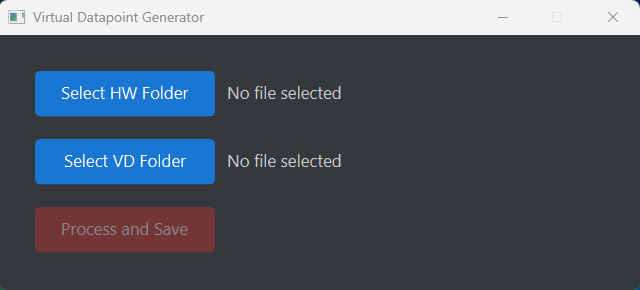
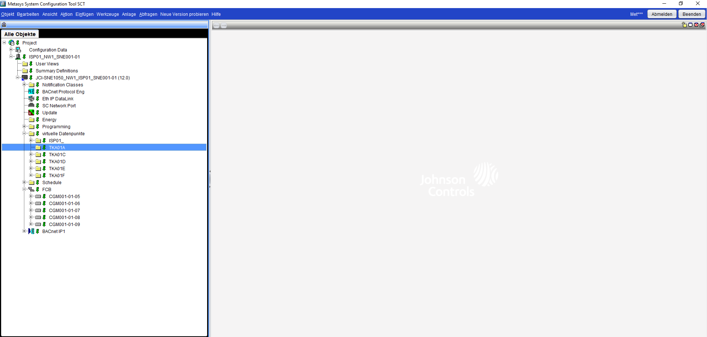
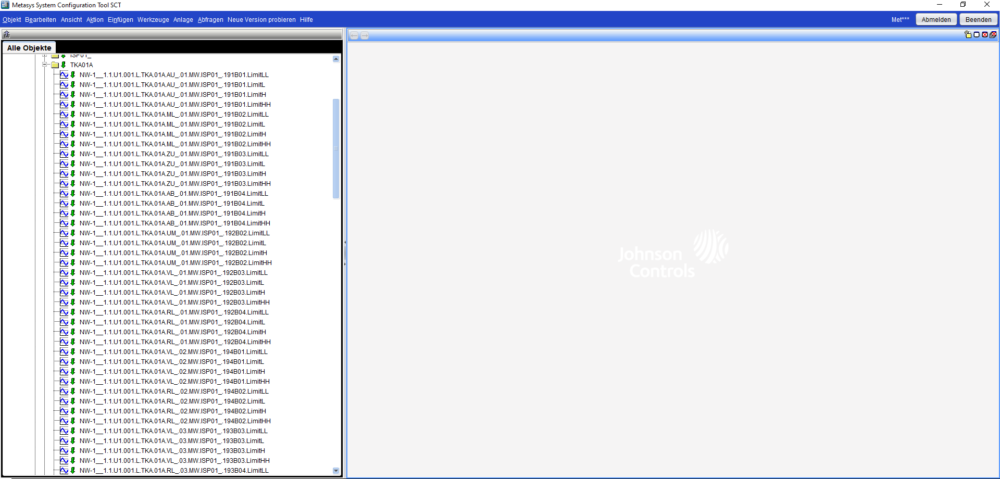

# VirtualDatapointGenerator

## Description
The **VirtualDatapointGenerator** is a Java based algorithm to generate **Virtual Datapoints** inside the **System Configuration Tool (SCT)**

*SCT documentation:*  
https://docs.johnsoncontrols.com/bas/r/Metasys/de-DE/Katalogseite-fur-SCT-System-Configuration-Tool/16.0/SCT-System-Configuration-Tool

*GUI of the VirtualDatapointGenerator*  

---

## The Issue
For a specific customer in HVAC industry, for each hardware temperature measure value, there have to be generated nine virtual datapoints:

- Limit LowLow
- Limit Low
- Limit High
- Limit HighHigh
- Alarm LowLow
- Alarm Low
- Alarm High
- Alarm HighHigh
- Fault  

To generate these datapoints manually (generating, naming, setting up) it takes at least 1-2 days of work (depends on the size of the system)  

---

## The Solution
The **VirtualDatapointGenerator** automates the generation and also takes care of the naming and the correct set up of the virtual datapoints.

**It reades and writes XML files, by using the Document Object Model**

1. The folder with the hardware datapoints and the destination folder for the virtual datapoints have to be exported from the **System Configuration Tool**  
2. Both folders have to be selected in the **VirtualDatapointGenerator**
3. After clicking **Process and Save** a **.txt** file is generated  
4. The content of the **.txt** file must be copied and pasted to the **export.xml** file inside the zip destination folder
5. After clicking save, the destination folder can be imported back to the **System Configuration Tool** and the datapoints are generated  

*Example: Screenshot of an empty folder without the virtual datapoints*  

*Example: Screenshot of an folder filled with the virtual datapoints*  

---

## Tools & Technologies
The project uses the following technologies and libraries:

- **Java 21** – main programming language  
- **Document Object Model** – for reading and writing XML files  
- **JavaFX** – for User Interface  
- **Maven** – for project build and dependency management
- **jlink and jpackage** - to generate a native windows image
- **ChatGPT** - for CSS styling   

---

## Info
**For privacy and data protection reasons, some details and workflows cannot be shown.  
If you have any questions regarding the data or the workflow, feel free to contact me.**

